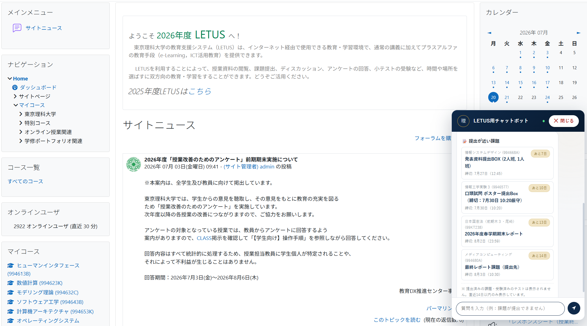
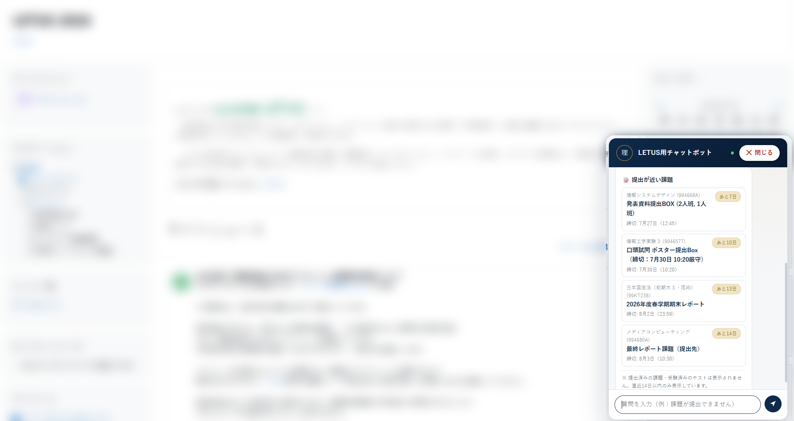

# LETUS チャットボット（非公式）

東京理科大学の学習支援システム **LETUS** の画面右下に、チャットボットを表示するブラウザ用ユーザースクリプトです。

> ⚠️ **これは学生が個人で開発した非公式ツールです。** 東京理科大学・情報システム課とは関係ありません。回答内容は必ず[公式のITサービスFAQ](https://faq.tus.ac.jp/?site_domain=student)でもご確認ください。

<!-- ここにチャットボットのスクリーンショットを貼ると導入率が上がります -->

## できること

- **FAQ検索** — 「課題が提出できません」「ログインできない」などの質問に、公式FAQ（LETUS関連約30件）から即答し、該当FAQページへのリンクを表示します
- **掲載場所ナビ** — 「語学検定」「時間割」「期末試験」などのキーワードから、LETUS内の掲載ページへ直接案内します
- **締切カウントダウン** — 未提出の課題・未受験の小テストを「あと◯日」のバッジ付きで一覧表示します（提出済みのものは表示されません）。明日締切の課題があるときは⚠️で強調します

すべてブラウザ内で完結します。**外部サーバーへの通信は一切ありません。** 締切情報は、あなたがログインしているLETUS自身のカレンダー機能から取得します。

## インストール方法

所要時間は5分ほどです。順番どおりに進めてください。

### 手順1. Tampermonkeyをインストールする

ユーザースクリプトを動かすためのブラウザ拡張機能です。

- Chrome：[Chromeウェブストア](https://chromewebstore.google.com/detail/dhdgffkkebhmkfjojejmpbldmpobfkfo)で「Tampermonkey」を検索して追加
- Edge：Microsoft Edgeアドオンストアで「Tampermonkey」を検索して追加

### 手順2. 開発者モードをONにする【重要・つまずきポイント①】

最近のChrome / Edgeでは、この設定をしないとユーザースクリプトが動きません。

1. アドレスバーに `chrome://extensions`（Edgeは `edge://extensions`）と入力して開く
2. **「開発者モード」のトグルをON**にする（Chromeは右上、Edgeは左下にあります）
3. ブラウザをいったん完全に終了して再起動する

> 💡 Chrome 138以降では、拡張機能一覧のTampermonkeyの「詳細」ページにある「ユーザースクリプトを許可する」をONにする方法でもOKです。
>
> 💡 開発者モードがONにできない（グレーアウトしている）場合、組織のポリシーで管理されたPCの可能性があります。その場合は上記の「ユーザースクリプトを許可する」を試してください。

### 手順3. Tampermonkey本体が有効か確認する【つまずきポイント②】

ブラウザ右上のTampermonkeyアイコンをクリックし、メニュー最上部の「**有効**」に**緑のチェック**が付いているか確認してください。赤い✕になっている場合は、その行をクリックしてONにします。

### 手順4. スクリプトをインストールする

下のリンクをクリックすると、Tampermonkeyのインストール確認画面が開きます。

👉 **[インストールはこちら](https://raw.githubusercontent.com/yuto0524999-sudo/letus-chatbot/main/letus-chatbot.user.js)**

「インストール」ボタンを押せば完了です。

### 動作確認

[LETUS](https://letus.ed.tus.ac.jp/) を開いて（すでに開いている場合はページを再読み込み）、右下に紺色の丸いボタンが表示されれば成功です。クリックするとチャットが開きます。

表示されない場合は、手順2と手順3をもう一度確認してください。

## アップデートについて

スクリプトはTampermonkeyが自動で更新を確認します。手動で最新版にしたい場合は、Tampermonkeyのダッシュボードでスクリプトを開き「ユーティリティ」→ 更新を実行するか、上のインストールリンクをもう一度開いてください。

## 制限事項

- **掲載場所ナビは工学部・工学研究科ポータルのリンクを前提**にしています。他学部の方はFAQ検索と締切カウントダウンのみ実質的に利用可能です（今後の対応を検討中です）
- FAQデータはスクリプト内に保持しているため、大学側のFAQ改訂に即時追従はできません。最新情報は必ずリンク先の公式FAQでご確認ください
- 締切カウントダウンはLETUS（Moodle）のカレンダー機能を情報源とするため、教員が締切をカレンダー連携なしで運用している課題は表示されないことがあります

## アンインストール

Tampermonkeyアイコン → ダッシュボード → このスクリプトのゴミ箱アイコンをクリックするだけです。LETUS側には何の変更も残りません。

## 免責

本スクリプトは無保証で提供されます。利用によって生じたいかなる損害についても、作者は責任を負いません。課題の提出状況・締切は必ずLETUS本体でご確認ください。

## ライセンス

[MIT License](LICENSE)
